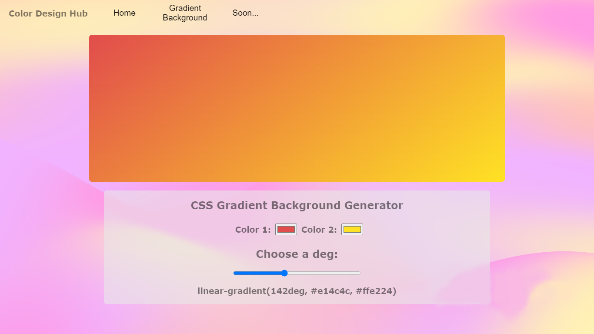

# What is it?
The Color Design Hub is the place where you can use ready-made design tools to create beautiful and colorful designs.
So far, the app has only a background gradient creator, and this is only the first deployment. In the future I want to create more design tools. App was deployed on https://delaklo.github.io/color-design-hub/
 

## How it looks

## Create together
Star the repository if you find at least one tool useful
 
And get involved if you have free time to make this app more useful for other developers like us
 
TO DO: color palette, ready-made gradient backgrounds